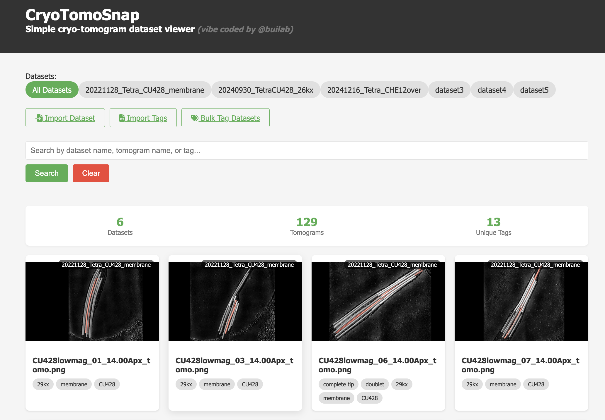
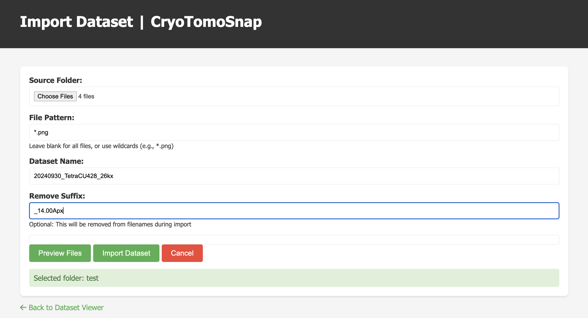
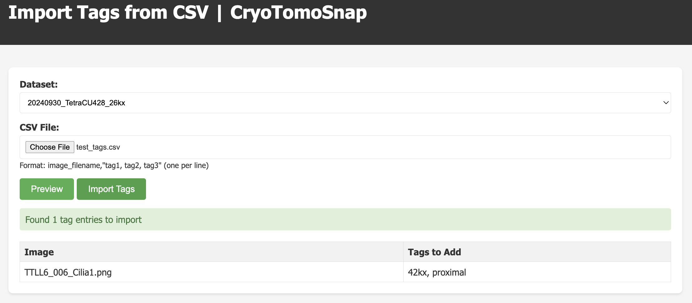
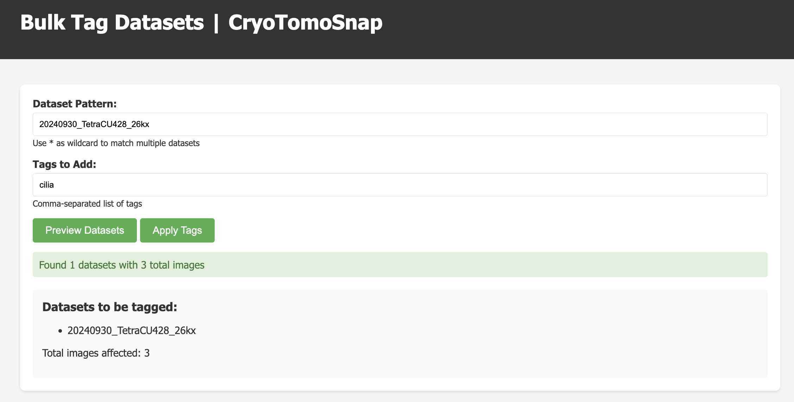

# CryoTomoSnap

A quick viewer to browse through tomography data with a tagging system to search for data.


---

## 1. Installation Steps

```bash
git clone https://github.com/builab/CryoTomoSnap.git
cd CryoTomoSnap
```


Initialize a Node.js project:
```
npm init -y
```

Install required dependencies:
```
npm install express cors glob multer
```

Copy dataset containing images to micrographs to initialize 
```
cp -r /path/to/your/dataset micrographs/
```

## 2. Run the Server

Start the server:
```
node server.js
```

You should see output like:
```
Server running on port 3000
```

## 3. Access the Application

Open a web browser and navigate to:
```
http://localhost:3000
```

## 4. Access the Application Remotely

SSH Port forwarding
```
ssh -i -N -f -L localhost:3000:localhost:3000 username@host
```

Open a web browser and navigate to:
```
http://localhost:3000
```

## 5. Usage

###5.1 Main Interface:




You can limit the dataset by name, part of name or tag in the Search box.


#5.2 Import a dataset

A dataset is a folder containing the mid-section of your tomogram or a snapshot of tomogram with segmentation.

The interface to import a dataset.



Press "Preview" first and then Import

#5.3 Import Tags

You can prepare a csv file in this format
```
CU428_006, "26kx, proximal"
CU428_028, "26kx, round"
CU428_033, "26kx, round"
```

Press "Preview" and then "Import". Duplicate tags will not be imported. The name in the csv file can be the exact image name or unique part of the image name.



#5.4 Bulk-Tag Dataset

Use this option to tag one or multiple dataset (with wildcard) with the same tag.


